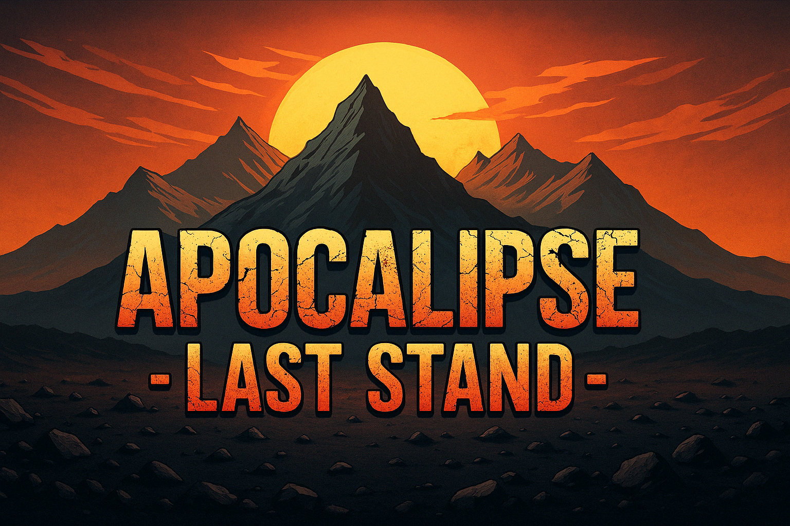

# Last Stand: Apocalypse

A first-person combat arena game developed with Three.js for the Introduction to Computer Graphics course (2024-25).

## Description

Last Stand: Apocalypse is a wave-based first-person shooter where players must survive increasingly difficult rounds of enemies. The game features various enemy types, weapon systems, and a complete game with progression.

## Technologies Used

- **Three.js** - 3D rendering engine
- **JavaScript** - Core programming language
- **HTML5 & CSS** - Structure and styling

## Features

- **First-person combat system** with multiple weapons:
  - Knife for melee attacks
  - Pistol with ammunition management
  
- **Enemy varieties** with unique behaviors:
  - Normal enemies (basic movement and attacks)
  - Tank enemies (slower but more health)
  - Ranged enemies (attack from distance)
  - Boss enemies (powerful end-round opponents)

- **Round progression** with increasing difficulty
  
- **Complete game systems**:
  - Player health and shield
  - Inventory management
  - Collision detection
  - Particle effects

- **Responsive UI**:
  - Dynamic HUD showing health and ammo
  - Inventory system
  - Pause menu
  - Customizable character

## How to Play

### Run Game

Access the game directly at:
[https://tiagobrito36.github.io/Projeto_ICG_2024-25/](https://tiagobrito36.github.io/Projeto_ICG_2024-25/)

### Controls

- **WASD** - Movement
- **Mouse** - Look around
- **Left Click** - Attack/Shoot
- **1-2** - Switch weapons
- **R** - Reload pistol
- **Shift** - Crouch
- **Space** - Jump
- **Tab** - Open inventory
- **P** - Pause game
- **Esc** - Exit pointer lock
- **F11** - Toggle fullscreen

## Game Mechanics

- Survive waves of enemies across 5 (for now) increasingly difficult rounds
- Defeat all enemies in a round to progress
- Manage your ammunition and health carefully
- Use the knife for close-range combat

## Project Structure

- `index.html` - Main HTML file
- `main.js` - Game logic and Three.js implementation
- `styles.css` - Styling for UI elements
- `assets/` - Game assets 

## Cheat Codes

For debugging and testing purposes, you can access the following cheat:
- Open the browser console (F12) and type `toggleInfiniteHealth()` to activate god mode

## Academic Context

This project was developed for the Introduction to Computer Graphics course at University of Aveiro during the 2024-25 academic year. It demonstrates practical application of 3D graphics programming concepts including:

- 3D rendering techniques
- Camera manipulation
- Collision detection
- Animation systems
- Lighting and materials
- User interface integration with 3D environments

## Author

Tiago Brito

---

*This project is for educational purposes only.*

