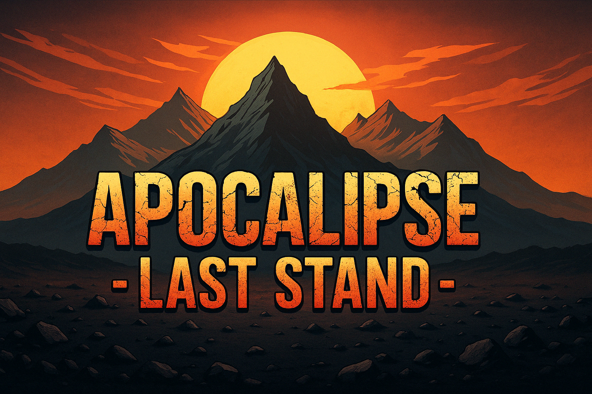

# Apocalipse: Last Stand 

A first-person combat arena game developed with Three.js for the Introduction to Computer Graphics course (2024-25).

## Description

Last Stand: Apocalipse is a wave-based first-person shooter where players must survive increasingly difficult rounds of enemies in a post-apocalyptic setting. The game features various enemy types, weapon systems, environmental elements, and a complete progression system with multiple bosses.

## Technologies Used

- **Three.js** - 3D rendering engine
- **JavaScript** - Core programming language
- **HTML5 & CSS** - Structure and styling

## Features

- **First-person combat system** with multiple weapons:
  - Knife for melee attacks
  - Pistol with standard firing mechanism
  - Shotgun with spread damage and range falloff
  - Assault Rifle with rapid fire capability
  - Sniper Rifle with scope functionality
  - Crossbow with retrievable bolts
  - Minigun with spin-up/down mechanics and overheating system
  - Rocket Launcher with area explosion damage
  - Ammunition management and reloading for all weapons
  
- **Extensive enemy variety** with unique behaviors:
  - Basic enemies (standard movement and attacks)
  - Tank enemies (slower but more health)
  - Speeder enemies (fast movement with strafe capabilities)
  - Ranged enemies (attack from distance with projectiles)
  - Teleporter enemies (can teleport closer to player)
  - Exploder enemies (explode on death causing area damage)
  - Shielder enemies (have front-facing shields reducing damage)
  - Healer enemies (heal nearby enemies)
  - Elite enemies (enhanced versions with special abilities)
  - Multiple boss types with unique attack patterns:
    - The Guardian (standard boss with multiple attack patterns)
    - The Warden (heavy boss with shield wall and ground slam abilities)
    - The Phantom (elusive boss with clones and void zones)
    - The Mega Boss (final challenge with devastating abilities)

- **Dynamic day-night cycle**:
  - Sun progresses across the sky during rounds 1-10
  - Moon rises from rounds 10-20
  - Dynamic lighting affecting visibility and gameplay
  - Automatic lamp activation during night rounds
  - Sky color changes based on time of day

- **Round progression** with increasing difficulty:
  - Multiple rounds with escalating enemy counts and types
  - Special boss rounds at key intervals
  - Victory screen upon completion
  
- **Complete game systems**:
  - Player health and shield mechanics
  - Ammunition management and reloading
  - Inventory system with 10 slots for items
  - Coin-based economy with categorized shop system
  - Advanced collision detection for projectiles and obstacles
  - Particle effects for impacts, explosions and environment
  - Hit markers and damage indicators
  - Enemy AI with obstacle avoidance

- **Responsive UI**:
  - Dynamic HUD showing health, shield, ammo and coins
  - Inventory display system with proper item icons
  - Categorized shop interface for purchasing weapons and consumables
  - Pause menu with game controls
  - Character customization options

- **Detailed environment**:
  - Apocalyptic road with damaged asphalt and markings
  - Dynamic mountain generation for terrain
  - Road blockades at map boundaries
  - Road lamps with realistic light effects:
    - Working lamps with steady light
    - Damaged lamps with flickering and spark effects
    - Broken lamps with physical damage details
  - Debris and environmental details

## How to Play

### Run Game

Access the game directly at:
[https://tiagobrito36.github.io/Projeto_ICG_2024-25/](https://tiagobrito36.github.io/Projeto_ICG_2024-25/)

### Controls

- **WASD** - Movement
- **Mouse** - Look around
- **Left Click** - Attack/Shoot
- **Right Click** - Toggle sniper scope
- **1-5** - Switch weapons/items
- **R** - Reload weapon
- **Tab** - Open inventory
- **B** - Open shop (when available)
- **P** - Pause game
- **Esc** - Exit pointer lock
- **F11** - Toggle fullscreen
- **F** - Toggle FPS display
- **Shift** - Crouch (experimental)
- **Space** - Jump (experimental)

## Game Mechanics

- Survive waves of enemies across increasingly difficult rounds
- Defeat all enemies in a round to progress to the next
- Manage your ammunition, health and shield carefully
- Collect coins from defeated enemies to purchase items
- Use the shop between rounds to upgrade your equipment
- Adapt your strategy for different enemy types
- Boss battles require specific tactics to overcome
- Day becomes night as rounds progress, changing gameplay dynamics

## Project Structure

- `index.html` - Main HTML file
- `main.js` - Game logic and Three.js implementation
- `styles.css` - Styling for UI elements
- `assets/` - Game assets including images and models

## Cheat Codes

For debugging and testing purposes, you can access the following cheats:
- Open the browser console (F12) and type:
  - `toggleInfiniteHealth()` - Activate god mode (infinite health)
  - `toggleInfiniteMoney()` - Unlimited coins
  - `skipToNextRound()` - Skip to the next round

## Academic Context

This project was developed for the Introduction to Computer Graphics course at University of Aveiro during the 2024-25 academic year. It demonstrates practical application of 3D graphics programming concepts including:

- 3D rendering techniques
- Camera manipulation
- Collision detection
- Animation systems
- Lighting effects 
- Particle systems
- Materials and textures
- User interface integration with 3D environments

## Author

Tiago Brito

---

*This project is for educational purposes only.*

## Patch Notes

### v1.1.1 (June 2, 2025) - Bug Fixes & Pricing Balances
- **Economy Rebalancing**:
  - Adjusted shop prices to better match game progression
  - Reduced prices of late-game weapons for better accessibility
  - Balanced consumable costs relative to their effectiveness

- **Bug Fixes**:
  - Fixed ranged enemy projectile detection and damage application
  - Round completion rewards now granted immediately after round ends instead of at next round start
  - Reverted player camera to its previous postion
  - Fixed road lamps always being on
  - Fixed round display showing incorrect values at game start
  - Fixed consumables timer being on top of the health bar
  - Fixed sniper scope not working

### v1.1.0 (June 1, 2025) - Shadow & Immersion Enhancement Update
- **Shadow System Overhaul**:
  - Added shadow casting to mountains, creating more realistic terrain
  - Road blockades now cast and receive shadows
  - Gas station structures properly cast shadows
  - Abandoned cars and GLTF models now cast shadows
  - Improved shadow map resolution for better visual quality
  
- **Player Experience Enhancements**:
  - Fixed camera clipping through player model when looking up
  - Player model now properly casts shadows
  - Adjusted camera position to eye level for better immersion

- **Weapon & Item Improvements**:
  - Updated bandage and rocket launcher appearance 
  - Enhanced item icons for better visibility in inventory

- **Audio Enhancements**:
  - Added weapon sound design for more impact
  - Added unique audio cues for item usage
  - Adden sound effects to the menus

- **Gameplay Tweaks**:
  - Using consumable items now properly applies movement speed reduction
  - Improved collision detection with environmental objects

### v1.0.0 (May 27, 2025) - Initial Release
- First public release of Apocalipse: Last Stand